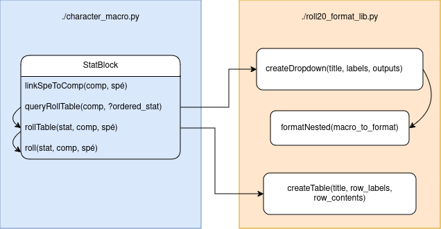

# Document utilisateur

> Executer le code en ligne : 

https://www.online-python.com/hVL8EmfoRA

Ce générateur de macro pour fiche perso a été réalisé dans le cadre du système One Piece (créer par Antoine Geslin, le vénérable MJ).

Il permet d'automatiser le lancer de dé 100 en se servant des attributs fournis dans la fiche de personnage sur roll20, tel que le système l'exige.

On distingue dans ce système 3 type d'attributs de fiche perso qui modifie le jet :
La stat de base (notée en majuscule et avec 3 lettres dans nos exemple), la compétence et la spécialité.
  
Le calcul total du jet ressemble a ceci : 

`Min(d100 + STAT_MOD + Competence + Spécialité , STAT_LIM) + Bonus - Fatigue`

- **STAT_MOD :** modificateur statistique (valeur déduite de la stat de base présent sur la fiche)
- **Compétence :** modificateur de compétence (valeur brute de la fiche)
- **Spécialité :** la spécialité (lié en général à une Compétence)
- **STAT_LIM :** valeur maximal que le jet pourra prendre (déduite de la stat de base).
- **Bonus :** modificateur optionnel qui permet de briser la limite de stat, et s'ajoute directement au résultat du jet, après calcul de limite. 
- **Fatigue :** malus de fatigue qui réduit également la limite (lorsque l'endurance du personnage passe dans les négatifs, il est ajouté au jet). 

---
## Utilisation du code
Dans un premier temps, il vous faudra importer la classe *StatBlock*, du fichier `./character_macro.py`

```py
import StatBlock
```

Puis instancier une nouvelle fiche de personnage avec : 

```py
perso = StatBlock()  
```

Ou éditer directement l'exemple de la partie main du code (ligne 300).

Voici les méthodes de générations utilisables : 

- **queryRollTable(Compétence, Stats) :**  Permet de générer une table qui demandera la stats à utiliser parmis les stats fournis en paramètre.
**Exemple :**
```py
perso.queryRollTable("Combat"  , ["DEX", "AGI", "SEN"])
```

- **linkSpeToComp(Compétence, Spécialité) :** Permet d'ajouter une ou plusieurs spécialités à une ou plusieurs compétences. (À utiliser avant la création de la table rollable).
**Exemple :**
```py
perso.linkSpeToComp("Combat", ["Attaque", "Parade", "Esquive"]) 
``` 
## Configuration sur roll20 
Voici un exemple de configuration de fiche perso avec cette outil :

### Ajouter les attributs
Maintenant que les macro sont effectué vous pouvers les copier du terminal et les placers dans leurs emplacements respectives.


Il faut nommer les attributs de types STAT, compétence et spécialité (et endurance) de la sorte, tel que définit dans l'image qui suit :

  

À noter que pour le calcul de fatigue, vous devez d'abord effectuer votre action consommant votre fatigue **AVANT** de retirer votre fatigue, car sinon le malus sera appliqué alors que vous n'avez pas encore effectuer l'action (obviously).

### Ajouter la macro 

### Exemple d'utilisation 
Lors du lancement de la macro de compétence nous avons les entrées suivantes :


Choix de la statistique à utiliser pour le jet (entre parenthèse la valeur de stat de base)


Optionnel : Choix de la spécialité, qui apparait si une ou plusieurs spécialités on été précisés


Choix du bonus final (entrer 0 ou rien pour ne pas avoir de bonus au jet)


En sortie : Le calcul au sein d'un tableau nommé automatiquement selon les entrées fournis.

## Diagramme du code 


## Utilisation avancé 

Vous pouvez également modifier les noms des attributs (STAT, compétences, spécialité et endurance) dans le code à votre guise, du moment que, sur la fiche perso, celui-ci soit définit.

Je ne recommande pas d'utiliser ces macros en dehors des fiches perso, car Roll20 à la fameuse tendance a d'encoder les charactère HTML, lorsque la macro est réouverte dans les macros globales.

Cependant il est également possible de définir un nom de personnage sur lequelle lier les macros (attribut ref_name de StatBlock).
